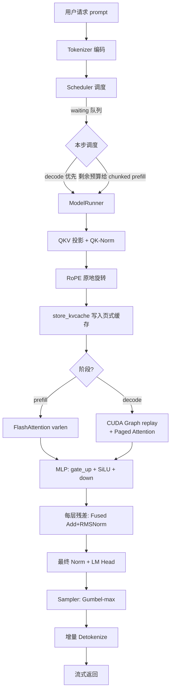

# 00 · 架构总览：模块分层与读码路径

> 目标：3 天读完全部核心代码。本文给你地图，后续每章是景点讲解。

> [文档目录](README.md)

## 一图看懂数据流



## 核心路径地图（★ = 3 天精读目标）

```
入口    llm.py ───────────────────────────────────── ~50 行
          │
调度 ★  engine/scheduler.py ──────────────────────── 260 行   decode优先 + chunked预算
          │
执行 ★  engine/model_runner.py ───────────────────── 450 行   CUDA Graph / 输入准备 / 采样
          │
算子 ★  layers/attention.py ──────────────────────── 310 行   PagedAttn / FP8 / Triton
          │        layers/linear.py · layernorm.py
          │        layers/rotary_embedding.py · sampler.py
          │
内核    nano_vllm/kernels/*.cu ───────────────────── ~200 行   fused rmsnorm / inplace rope
          │
基础    engine/block_manager.py ──────────────────── 270 行 ★ prefix caching
        engine/sequence.py (150) · utils/context.py (60)
        engine/async_llm_engine.py (200) · utils/loader.py (60)
```

## 全局设计模式（读码前先知道这些）

1. **全局 Context 传递元数据**（`utils/context.py`）：每步的 slot_mapping/block_tables 等通过
   进程级单例传递，而不是层层传参。好处是模型层签名干净；代价是读码时要先找 `set_context`
   的调用点。这是模仿 vLLM 的设计。
2. **Scheduler 与 ModelRunner 分离**：调度纯 CPU 逻辑（可单测，见 `test_chunked_prefill.py`），
   执行纯 GPU 逻辑。压测脚本 `benchmarks/level1_service.py` 直接驱动这两个类，绕过 LLM 门面。
3. **Block 一切皆资源**：KV cache 是页式管理的物理块，prefix caching 是块的哈希索引共享，
   抢占（preemption）是块回收重排。理解了 `block_manager.py` 就理解了显存管理。
4. **Graph 静态化**：CUDA Graph 要求 tensor 地址固定，所以 decode 输入全部预分配为 static
   buffer，每步 `copy_` 进去再 replay。

## 3 天读码计划

| 天 | 内容 | 配合文档 | 产出检验 |
|---|------|---------|---------|
| D1 | 跑通推理 → `sequence.py` → `scheduler.py` | 03 | 画出一次 schedule 的队列变化 |
| D2 | `model_runner.py` → CUDA Graph 捕获/回放 | 01, 06 | 说出 static tensor 为什么必须存在 |
| D3 | `attention.py` → `kernels/` → `block_manager.py` | 02, 04, 05 | 解释 prefix 命中的完整链路 |

## 扩展方向（进阶阅读）

- **vLLM V1 架构对照**：vLLM 把调度器+KV 管理放独立进程（EngineCore），前端 asyncio 进程
  通过 ZMQ 与其通信，请求可远超引擎处理速度。本项目单进程实现，读完源码后对照
  vLLM 的 `vllm/v1/engine/` 目录看进程边界设计，收获最大。
- **SGLang**：额外引入 RadixAttention（前缀树形式的 KV 复用，比本项目块级哈希更细），
  以及独立的 tokenizer/detokenizer 进程。
- 两者都在本项目 roadmap：见 README Roadmap 章节。

---

**下一篇**：[CUDA Graph：消除 Decode 阶段的 Kernel 启动开销](01-cuda-graph.md)
